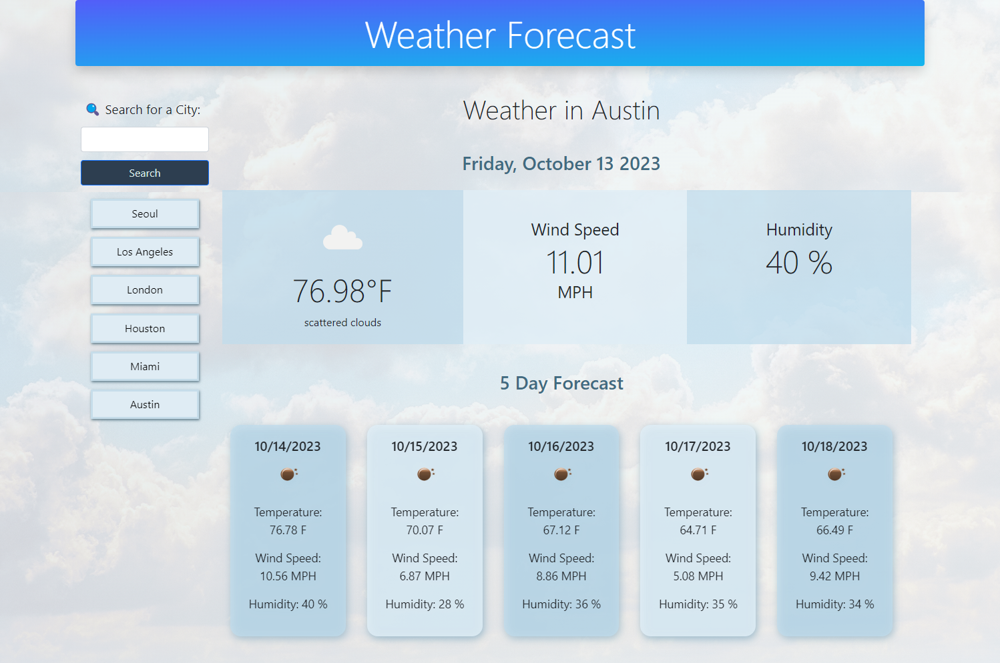
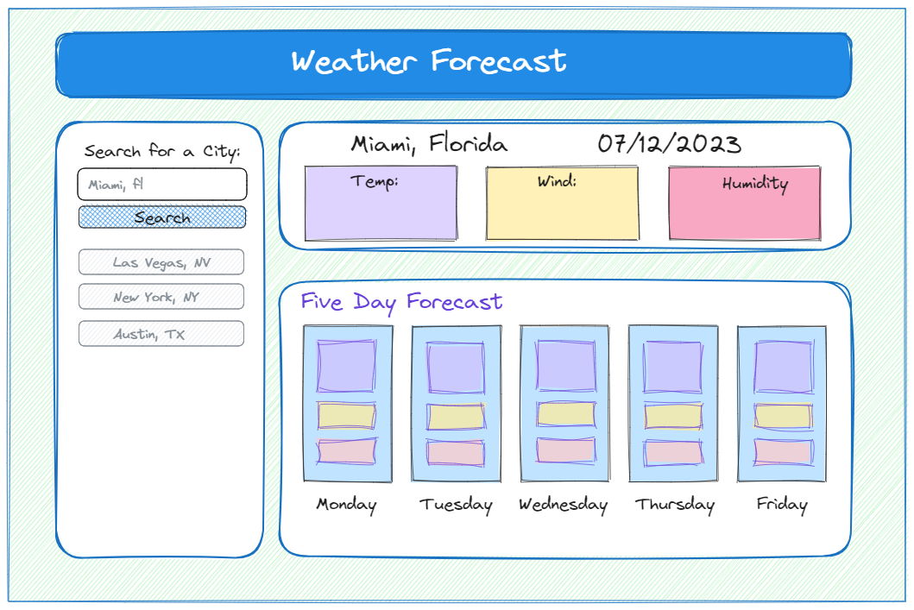

# Weather Forecaster
Module 6 Server-Side APIs Challenge: Weather Dashboard

This weather dashboard allows users to search for a city and learn about the weather conditions for that specific place from the weather results that are displayed.

## Deployed Application
You can view the live application
[here ➡️](https://cyphernyx.github.io/forecaster-js/)





## Usage 

- search for a city
- You will be presented with current and future conditions for that city 
- Current weather conditions for selected city includes city name, the date, an icon representation of weather conditions, the temperature, the humidity, and the wind speed
- 5-day forecast that displays the date, an icon representation of weather conditions, the temperature, the wind speed, and the humidity

## Installation
To use the Forecaster - weather dashboard, follow these steps:

1. Clone the repository or download the project files to your local machine.

```sh
git clone git@github.com:CypherNyx/forecaster-js.git
```
2. Open the project directory.
3. Open the index.html file in a web browser.

## Credits
- Background image: [Billy Huynh @ Unsplash](https://unsplash.com/photos/v9bnfMCyKbg?utm_source=unsplash&utm_medium=referral&utm_content=creditShareLink)